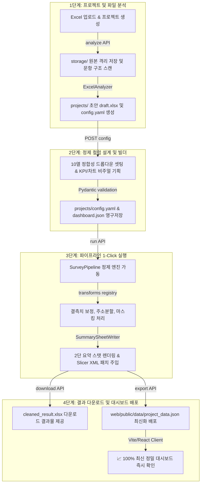
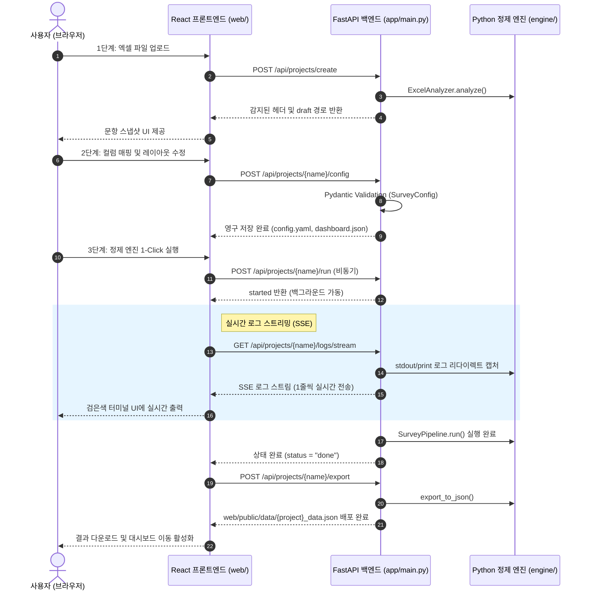

# ClearSurvey — 사용 가이드

> 설문·행정 데이터 정제 엔진 + 웹 대시보드 통합 가이드  
> 최종 업데이트: 2026-05-28

---

## 목차

1. [시스템 개요 — 두 가지 사용 모드](#1-시스템-개요--두-가지-사용-모드)
2. [빠른 시작 (Quick Start)](#2-빠른-시작-quick-start)
3. [실행 방법](#3-실행-방법)
4. [CLI 전체 워크플로우](#4-cli-전체-워크플로우)
5. [웹 관리자 마법사 (Admin Wizard)](#5-웹-관리자-마법사-admin-wizard)
6. [Config 파일 레퍼런스](#6-config-파일-레퍼런스)
7. [Transform 레퍼런스](#7-transform-레퍼런스)
8. [다중 소스 병합](#8-다중-소스-병합)
9. [새 Transform 추가](#9-새-transform-추가)
10. [상세 가이드 문서](#10-상세-가이드-문서)

---

## 1. 시스템 개요 — 두 가지 사용 모드

```
┌─────────────────────────────────────────────────────────┐
│  ClearSurvey                                            │
│                                                         │
│  [1단계 CLI 모드]           [2단계 웹 마법사 모드]        │
│  Python CLI만 사용          브라우저 + 백엔드 API 사용   │
│                                                         │
│  xlsx → analyze → run       파일 업로드 (Step 1)        │
│       → export → 웹대시보드  설정 편집  (Step 2)        │
│                             파이프라인 실행 (Step 3)    │
│  ─────────────────────────  ─────────────────────────── │
│  start_web.bat              start_backend.bat +         │
│  (대시보드 확인용)           start_web.bat               │
└─────────────────────────────────────────────────────────┘
```

### 전체 데이터 흐름

#### 1) 시스템 데이터 라이프사이클 흐름도 (Data Lifecycle Flow)



#### 2) 웹 마법사 및 백엔드 실시간 정제 시퀀스 다이어그램 (Sequence Diagram)



---

## 2. 빠른 시작 (Quick Start)

### 환경 준비 (최초 1회)

```bash
# Python 의존성
pip install -r requirements.txt

# 웹 의존성 (start_web.bat 또는 직접 설치)
cd web && npm install && cd ..
```

### 1단계: CLI 모드 (백엔드 없이)

```bash
# 1. 엑셀 파일 분석 + Draft 설정 생성
python main.py analyze storage/my_data.xlsx
# → storage/draft_my_data.xlsx 자동 생성

# 2. Draft xlsx에서 Config 시트 수정 (transform, output_col 등)

# 3. 파이프라인 실행
python main.py run storage/draft_my_data.xlsx --input storage/my_data.xlsx
# → projects/my_survey/output/my_survey_cleaned.xlsx

# 4. 웹 대시보드용 JSON 내보내기
python main.py export projects/my_survey/config.yaml

# 5. 웹 대시보드 확인
start_web.bat       # Windows
# 또는: cd web && npm run dev → http://localhost:5173
```

### 2단계: 웹 마법사 모드

```bash
# 터미널 1 — FastAPI 백엔드
start_backend.bat   # → http://localhost:8000

# 터미널 2 — React 웹 대시보드
start_web.bat       # → http://localhost:5173

# 브라우저에서 http://localhost:5173/admin 접속
# → Step 1 파일 업로드 → Step 2 설정 편집 → Step 3 실행 및 내보내기
```

---

## 3. 실행 방법

### 배치 파일 (Windows)

| 파일 | 설명 | URL |
|------|------|-----|
| `start_web.bat` | Vite 개발 서버 (웹 대시보드) | http://localhost:5173 |
| `start_backend.bat` | FastAPI 백엔드 API | http://localhost:8000 |

### 수동 실행

```bash
# 웹 대시보드 (Vite 개발 서버)
cd web
npm install      # 최초 1회
npm run dev      # → http://localhost:5173

# FastAPI 백엔드
uvicorn app.main:app --reload --host 127.0.0.1 --port 8000
# API 문서: http://localhost:8000/docs
```

### 페이지 구성

| URL | 역할 |
|-----|------|
| `http://localhost:5173/` | 대시보드 (KPI·차트·데이터 테이블) |
| `http://localhost:5173/admin` | 3단계 설정 마법사 |

---

## 4. CLI 전체 워크플로우

### 분석 설계 흐름

```
원본 xlsx
    │
    ▼
[Phase 0] ExcelAnalyzer
    • 시트 목록 확인
    • 헤더 행 자동 감지 (점수 기반)
    • draft_*.xlsx 생성 (Config 시트 포함)
    │
    ▼
[Phase 1] Preprocessor  ← config.preprocess 적용
    • fill_down  : 계층·merged cell 값 아래로 채우기
    • row_filter : include(AND) / exclude(OR) 행 필터링
    │
    ▼
[Phase 2] CleanedSheetWriter  ← config.columns 적용
    • 컬럼별 TransformRegistry.apply() 호출
    • Row 1: SUBTOTAL 집계 행
    • Row 2: 헤더 (output_col 이름)
    • Row 3+: 정제된 데이터
    • Excel Table + 슬라이서 삽입
    │
    ▼
[Phase 3] SummarySheetWriter  ← config.summary 적용
    • layout 기반 섹션 위치 자동 계산
    • 섹션별 COUNTIF / SUMIF / AVERAGEIF 수식 삽입
    │
    ▼
[Phase 4] 출력
    • Config 시트 (편집 후 재실행 가능)
    • Guide 시트 (사용법·레퍼런스)
    • → 최종 xlsx 저장
    │
    ▼
[Phase 5] export → web/public/data/*.json → 웹 대시보드
```

### CLI 명령어 레퍼런스

```bash
# ── 분석 ──────────────────────────────────────────────────────────────
# 기본: 원본 파일과 같은 폴더에 draft_*.xlsx 자동 생성
python main.py analyze storage/data.xlsx

# 화면 출력(JSON)만, 파일 생성 없음
python main.py analyze storage/data.xlsx --dry-run

# 프로젝트 폴더 구조로 저장
python main.py analyze storage/data.xlsx --project my_survey --save-project

# ── 실행 ──────────────────────────────────────────────────────────────
# draft xlsx로 실행 (빠른 검증)
python main.py run storage/draft_data.xlsx --input storage/data.xlsx

# yaml로 실행 (전처리 fill_down/row_filter 포함)
python main.py run projects/my_survey/config.yaml --input storage/data.xlsx

# 결과물 Config 시트 수정 후 재실행 (라운드트립)
python main.py run projects/my_survey/output/my_survey_cleaned.xlsx --input storage/data.xlsx

# ── 내보내기 ──────────────────────────────────────────────────────────
# 웹 대시보드용 JSON 생성
python main.py export projects/my_survey/config.yaml

# ── 배포 ──────────────────────────────────────────────────────────────
# 단일 프로젝트 독립 웹 패키지 생성
python main.py deploy projects/my_survey/config.yaml --dest dist/my_survey

# ── 유틸리티 ──────────────────────────────────────────────────────────
python main.py new-project <name>         # 빈 프로젝트 폴더 생성
python scripts/gen_dummy.py               # 더미 데이터 재생성
```

### Phase별 상세 설명

#### Phase 1 — 전처리

**fill_down** — 계층 데이터 채우기

```yaml
preprocess:
  fill_down:
    - source_col: 1
      output_label: "사업코드"
      mode: always           # always | on_trigger
```

**row_filter** — 행 필터링

```yaml
preprocess:
  row_filter:
    include:                 # AND — 모두 만족하는 행만 포함
      - col: 3
        values: [7]
    exclude:                 # OR — 하나라도 해당하면 제외
      - col: 3
        is_empty: true
```

#### Phase 2 — 컬럼 정의

```yaml
columns:
  - output_col: "기관명"
    source_col: 6
    transform: copy
    width: 22

  - output_col: "소재지_시도"
    source_col: 11
    transform: addr_split     # → 원본 + _시도/_시군구/_상세 파생열 4개 자동 생성
    width: 8

  - output_col: "O_학습"
    source_col: 15
    transform: to_binary
    flag_keyword: "대규모 AI 모델 학습"
    include_in_slicer: true
```

#### Phase 3 — 요약 시트

```yaml
summary:
  layout:
    cols: 2          # 2단 레이아웃
    start_row: 1
    col_span: 4
    gap_cols: 1
    gap_rows: 2
  sections:
    - id: totals
      title: "▶ 1. 전체 현황"
      type: totals
      layout_col: 1
      items:
        - { label: "총 응답자", type: count_all, col_ref: "답변ID" }
    - id: by_region
      title: "▶ 2. 지역별"
      type: unique_count
      layout_col: 2
      col_ref: "소재지_시도"
```

#### Phase 5 — 웹 대시보드

```bash
# JSON 내보내기
python main.py export projects/my_survey/config.yaml
# → web/public/data/my_survey_data.json
# → web/public/data/projects.json 갱신

# 대시보드 확인
start_web.bat   # → http://localhost:5173
```

---

## 5. 웹 관리자 마법사 (Admin Wizard)

브라우저에서 **`http://localhost:5173/admin`** 접속 (백엔드 `start_backend.bat` 필요)

```
Step 1 — 파일 업로드
  엑셀 파일 드래그앤드롭 또는 선택
  → 서버에서 자동 분석 (헤더 감지, 컬럼 목록)

Step 2 — 설정 편집
  [컬럼 정제 정의]
    output_col, source_col, transform 드롭다운 편집
    include_in_slicer 체크박스
  [대시보드 비주얼 레이아웃]
    KPI 카드, 차트 타입·컬럼 설정

Step 3 — 실행 및 내보내기
  파이프라인 실행 (백그라운드 처리 + 상태 폴링)
  결과 xlsx 다운로드
  대시보드 JSON 내보내기
```

### Admin Step 2 — Transform 선택 (드롭다운)

| Transform | 설명 |
|-----------|------|
| `copy` | 원본 값 그대로 |
| `exclude` | 출력에서 제외 |
| `norm_date` | 날짜 표준화 (YYYY-MM-DD) |
| `norm_date_parts` | 날짜 + 연/월/일 파생열 4개 자동 생성 |
| `norm_phone` | 전화번호 정규화 |
| `norm_company` | 회사명 정규화 |
| `norm_text` | 텍스트 공백 정리 |
| `norm_num` | 숫자 정규화 |
| `norm_position` | 직함 정규화 |
| `val_email` | 이메일 유효성 검사 |
| `val_brn` | 사업자번호 유효성 검사 |
| `mask_name` | 이름 마스킹 |
| `mask_rrn` | 주민번호 뒷자리 마스킹 |
| `to_binary` | 키워드 포함 여부 → 1/0 |
| `to_pct` | 퍼센트 문자열 → float |
| `addr_split` | 주소 → 시도/시군구/상세 파생열 4개 |
| `group_sum` | 다중 컬럼 합산 |

---

## 6. Config 파일 레퍼런스

### 전체 구조

```yaml
project: str                 # 프로젝트 이름 (영문·숫자·_·-)
style_file: str | null       # style.yaml 경로 (선택)

source:
  sheet: str | null          # 시트 이름 (null = 첫 번째)
  file: str | null           # 입력 파일 경로 (--input 우선)
  header_row: int            # 헤더 행 (1-indexed)
  data_start_row: int | null # 데이터 시작 행

paths:
  output_dir: str
  output_file: str

sheets:
  cleaned: str
  summary: str

preprocess:
  fill_down: [FillDownRule]
  row_filter:
    include: [RowFilterRule]
    exclude: [RowFilterRule]

columns: [ColumnDef]         # 컬럼 정의 배열

slicers:
  - col: str                 # output_col 이름
    caption: str | null

summary:
  sheet_name: str
  layout:
    cols: int
    start_row: int
    col_span: int
    gap_cols: int
    gap_rows: int
  sections: [SummarySection]

merge:                       # 다중 소스 병합 (선택)
  sources: [MergeSource]
  dedup: DedupConfig
  output: MergeOutputConfig
```

### Config 시트 편집 가능 항목 (10열)

| 열 | 항목 | 설명 |
|----|------|------|
| 1 | # | 순번 |
| 2 | 구분 | include / exclude 드롭다운 |
| 3 | output_col | 출력 컬럼명 |
| 4 | source_col_name | 원본 헤더명 (참조용) |
| 5 | source_col | 원본 열번호 (드롭다운) |
| 6 | transform | 변환규칙 (드롭다운) |
| 7 | include_in_slicer | 슬라이서 등록 여부 |
| 8 | source_cols | group_sum 전용 합산 열 목록 |
| 9 | flag_keyword | to_binary 키워드 |
| 10 | backup_col | 대체 열번호 |

> YAML 전용 속성: `width`, `source_label`, `year_col`, `fill_down`, `row_filter`, `summary` 세부 항목

### 라운드트립 규칙

| 저장됨 (xlsx 재실행 가능) | 저장 안 됨 (yaml 필요) |
|---|---|
| 컬럼 정의 (output_col, transform 등) | preprocess (fill_down, row_filter) |
| 기본 설정 (header_row, 파일명) | binary_sum / countif_contains 세부 항목 |
| 요약 섹션 (id, title, type, col_ref) | address_parsing 패턴 |

---

## 7. Transform 레퍼런스

### 7-1. 범용 클렌징

| transform | 입력 예시 | 출력 예시 | 설명 |
|-----------|----------|----------|------|
| `copy` | `"홍길동"` | `"홍길동"` | 원본 그대로 |
| `exclude` | — | — | 출력에서 제외 |
| `norm_text` | `"  ABC  "` | `"ABC"` | 공백·줄바꿈 정리 |
| `norm_num` | `"1,234"`, `"3.5만"` | `1234`, `35000` | 숫자 정규화 |
| `norm_date` | `"2026년 1월 15일"` | `"2026-01-15"` | 날짜 → YYYY-MM-DD |
| `norm_date_parts` | `"2026-01-15"` | 4열 자동 생성 | 날짜 + 연/월/일 파생열 |
| `norm_phone` | `"01012345678"` | `"010-1234-5678"` | 전화번호 표준화 |
| `norm_company` | `"주식회사 카카오"` | `"카카오"` | 법인형태 제거 |
| `norm_position` | 직함 원본 | 표준 직함명 | 직책 정규화 |
| `mask_name` | `"홍길동"` | `"홍*동"` | 이름 중간 마스킹 |
| `mask_rrn` | 주민번호 | 뒷자리 마스킹 | 개인정보 마스킹 |
| `val_email` | 이메일 | 유효시 원본 / 무효시 null | 이메일 검증 |
| `val_brn` | `"120-81-00434"` | 유효시 정규화 / 무효시 null | 사업자번호 검증 |
| `to_binary` | 텍스트 | `1` / `0` | flag_keyword 포함 여부 |
| `to_pct` | `"92.77%"` | `92.77` | 퍼센트 → float |
| `addr_split` | 주소 전체 | 4열 자동 생성 | 원본 + 시도/시군구/상세 |
| `group_sum` | 복수 열 | 합산값 | source_cols 지정 |

> **구 이름 alias**: `normalize_text`, `normalize_number`, `normalize_date`, `normalize_phone`, `normalize_company`, `name_blind`, `validate_brn`, `o_binary`, `address_sido`, `address_sigungu` 등 기존 이름도 동작합니다.

### 7-2. 컬럼 타입별 권장 transform

| 데이터 유형 | 권장 transform |
|------------|---------------|
| 텍스트 | `copy` 또는 `norm_text` |
| 숫자·금액 | `norm_num` |
| 날짜 | `norm_date` 또는 `norm_date_parts` |
| 전화번호 | `norm_phone` |
| 회사명 | `norm_company` |
| 이름 | `mask_name` |
| 사업자번호 | `val_brn` |
| 주소 | `addr_split` |
| 다중선택 키워드 | `to_binary` + `flag_keyword` |
| 여러 열 합산 | `group_sum` + `source_cols` |

### 7-3. Summary 섹션 타입

| type | 설명 |
|------|------|
| `totals` | 고정 항목별 카운트 |
| `unique_count` | 고유값별 자동 집계 |
| `binary_sum` | 0/1 이진 컬럼 합산 |
| `gpu_demand` | 합계+건수+평균 |
| `countif_contains` | 키워드 와일드카드 집계 |

---

## 8. 다중 소스 병합

```yaml
merge:
  sources:
    - path: "data/2025/"      # 폴더: *.xlsx 전체 읽기
      header_row: 1
      column_mapping:
        "기관 이름": "기관명"
    - path: "data/extra.xlsx"
      header_row: 2
  dedup:
    strategy: first           # first | last | none
    key_cols: ["답변ID"]
  output:
    add_source_col: true
    source_col_name: "_출처파일"
```

```bash
python main.py merge projects/multi/config.yaml --output merged.xlsx
python main.py run projects/multi/config.yaml   # merge 후 pipeline 자동 실행
```

---

## 9. 새 Transform 추가

`transforms/domain/` 에 모듈을 추가하면 자동 로드됩니다.

```python
# transforms/domain/my_transforms.py
def my_custom_fn(val, **kw):
    return str(val).upper() if val else None

_TRANSFORMS = {
    "my_upper": my_custom_fn,
}
```

```yaml
columns:
  - output_col: "항목_대문자"
    source_col: 5
    transform: my_upper
```

---

## 10. 상세 가이드 문서

> 문서 전체 인덱스: [docs/README.md](docs/README.md)

### 설계 가이드

| 문서 | 내용 |
|------|------|
| [docs/workflow_guide.md](docs/workflow_guide.md) | 전체 운영 워크플로우 (처음부터 끝까지) |
| [docs/config_guide.md](docs/config_guide.md) | config.yaml + Excel Config 시트 상세 |
| [docs/project_config_guide.md](docs/project_config_guide.md) | 프로젝트 폴더 구성 및 설정 스키마 |
| [docs/analyze_and_merge.md](docs/analyze_and_merge.md) | 분석·병합 상세 설계 |
| [docs/python_guide.md](docs/python_guide.md) | Python 정제 엔진 상세 |
| [docs/backend_guide.md](docs/backend_guide.md) | FastAPI 백엔드 API 레퍼런스 |
| [docs/frontend_guide.md](docs/frontend_guide.md) | React 웹 프론트엔드 구조 |
| [docs/integrated_guide.md](docs/integrated_guide.md) | 전체 시스템 연계 데이터 플로우 |

### 작업 로그

| 문서 | 내용 |
|------|------|
| [docs/log/worklog.md](docs/log/worklog.md) | 개발 작업 로그 (마일스톤 이력) |
| [docs/log/qna.md](docs/log/qna.md) | 운영 Q&A 및 설계 결정 내역 |
| [docs/log/system_analysis_2026-05-27.md](docs/log/system_analysis_2026-05-27.md) | 시스템 분석 보고서 |
