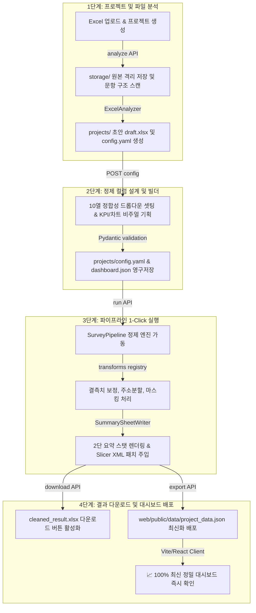
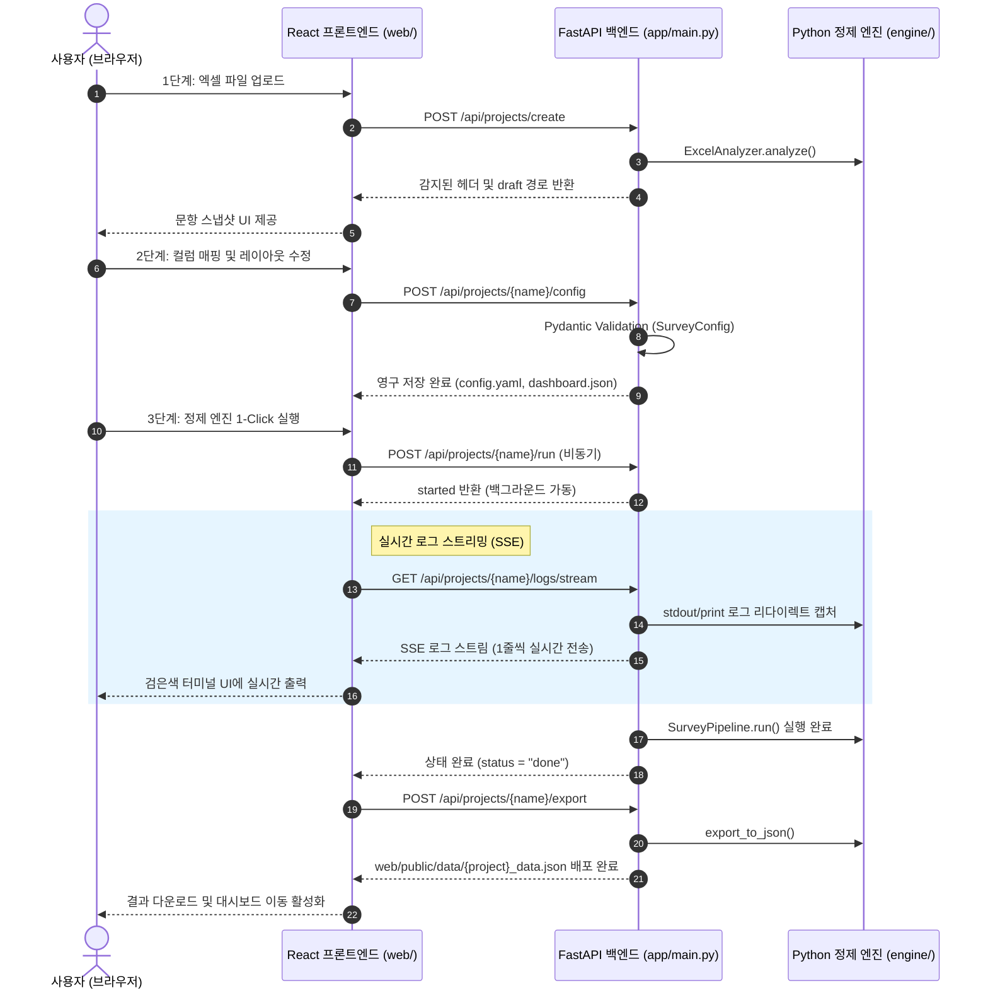

# 📊 ClearSurvey (클리어서베이)

[](https://www.python.org/)
[](https://vite.dev/)
[](https://fastapi.tiangolo.com/)
[](https://pages.github.com/)
[](#2-백엔드-서버-분리-운영-설계의-타당성)

> **1-Click 데이터 정밀 정제 · 엑셀 자동 요약 보고서 발행 · 하이브리드 인터랙티브 웹 대시보드**  
> 설문지나 업무용 행정 데이터 등 원본 엑셀(Raw Data)의 불완전하고 결측된 구조를 파이썬 정제 파이프라인 엔진을 통해 **정밀 클렌징**하고, openpyxl 및 슬라이서 패치 기술로 **엑셀 요약 보고서**를 발행하며, **FastAPI ➡️ React/Vite/shadcn/ui**의 프리미엄 하이브리드 대시보드를 연계 공급하는 차세대 풀스택 데이터 지능 플랫폼입니다.

---

## 📌 주요 특징 (Key Features)

* **🔄 하이브리드 듀얼 모드**:
  - **정적 모드 [Static Mode]**: 백엔드 연결이 차단된 GitHub Pages 환경에서도 데모 JSON을 파싱하여 차트, 드로어, PDF/CSV 편의 기능을 우아하게 서비스합니다.
  - **풀스택 모드 [Fullstack Mode]**: 로컬 API 서버(FastAPI)와 연동되어 신규 파일 업로드, 10열 드롭다운 매핑, 실시간 정제 파이프라인 트리거가 즉시 가능합니다.
* **📋 10열 드롭다운 컬럼 정의 시트**: 엑셀의 정밀 정합성 및 변환 규칙(Transforms 20여종), 원본 엑셀 열번호 매핑 등을 마우스 클릭 몇 번으로 쉽게 편집하고 `config.yaml`에 영구 저장합니다.
* **📊 대시보드 비주얼 빌더**: 대시보드 상단에 배치될 KPI 핵심 스탯 및 시각화 차트(Donut, Bar, Hbar, Histogram, Multibar)를 타이핑 없이 비주얼 폼을 통해 기획 설계합니다.
* **📟 실시간 런타임 로그 스트리밍**: 정밀 분석기 및 클렌징 엔진의 구동 로그 과정을 검은색 터미널 콘솔창 레이아웃을 통해 실시간으로 눈으로 투명하게 확인합니다.
* **📱 프리미엄 슬라이딩 드로어 & PDF**:
  - **우측 상세 드로어**: 테이블 행 클릭 시 화면 우측에서 부드럽게 미끄러지듯 노출되는 Drawer 상세 템플릿.
  - **A4 PDF 저장**: 상세 패널 레이아웃(여백, Noto Serif 폰트, 정렬)을 A4 가로/세로 오피스 규격 PDF 파일로 즉시 저장 다운로드합니다.
* **💾 Excel Slicer 주입 해킹 기술**: 가공된 최종 엑셀 파일 내부에 네이티브 오피스 Slicer 피벗 XML을 파이썬 ZipArchive 컴파일 기법으로 강제 주입하여, 엑셀을 여는 순간 테이블 옆에 네이티브 다차원 필터링 버튼이 즉시 활성화됩니다.

---

## ⚙️ 시스템 아키텍처 (Architecture)

### 1. 데이터 흐름도 (Data Lifecycle Flow)



### 2. 웹 마법사 실시간 정제 시퀀스 (SSE Sequence Diagram)



---

## 📂 디렉토리 구조 (Directory Structure)

```
ClearSurvey/
├── main.py                     # CLI 데이터 정제 및 내보내기 조율 스크립트
├── GUIDE.md                    # ★ 메인 통합 가이드 (시작점)
├── start_web.bat               # 프론트엔드 Vite 개발 서버 배치 스크립트
├── start_backend.bat           # FastAPI 백엔드 서버 배치 스크립트
├── pyproject.toml / uv.lock    # 파이썬 의존성 패키지 명세
├── storage/                    # [Git 제외] 업로드된 설문 원본 엑셀(Raw Data) 임시 보관소
├── backup/                     # 과거 백업 문서 및 분석 자료 보존 폴더
├── engine/                     # 핵심 정제 파이프라인 코어 엔진 모듈
├── transforms/                 # 날짜/주소/마스킹 등 개별 변환 함수 레지스트리
├── projects/                   # 서브프로젝트별 yaml, json 설정 및 output 보관소
├── app/                        # FastAPI 백엔드 서버 (main.py)
├── tests/                      # pytest 단위·통합·API 테스트
├── docs/                       # 설계 가이드 문서 보관 폴더
│   ├── workflow_guide.md       # 전체 운영 워크플로우 (처음부터 끝까지)
│   ├── config_guide.md         # config.yaml + Excel Config 시트 10열 구조
│   ├── project_config_guide.md # 프로젝트 폴더 구성 및 설정 스키마
│   ├── analyze_and_merge.md    # 사전 분석 및 다중 소스 병합 설계
│   ├── python_guide.md         # Python 정제 엔진 (transforms, pipeline)
│   ├── backend_guide.md        # FastAPI 백엔드 API 엔드포인트 명세
│   ├── frontend_guide.md       # React/Vite 웹 프론트엔드 컴포넌트 구조
│   ├── integrated_guide.md     # 전체 시스템 연계 데이터 플로우
│   ├── log/                    # 작업 로그 및 분석 보고서
│   │   ├── worklog.md          # 개발 작업 로그 (마일스톤 이력)
│   │   ├── qna.md              # 운영 Q&A 및 설계 결정 내역
│   │   └── system_analysis_2026-05-27.md  # 시스템 분석 보고서
│   ├── plan/                   # 구현 계획 및 상세 설계서
│   └── project/                # 프로젝트별 참고 문서
└── web/                        # React / Vite 웹 대시보드 및 3단계 마법사
```

---

## ⚡ 빠른 시작 (Getting Started)

### 1. 로컬 백엔드 API 서버 가동
파이썬 환경에 필수 의존성을 설치하고 FastAPI 서버를 가동합니다:
```bash
# uvicorn 실행 (기본 8000 포트)
python -m uvicorn app.main:app --reload
```
* 서버 가동이 성공하면 `http://localhost:8000/api/health` 핑을 통해 백엔드가 활성화되어 설정 매니저와 동기화됩니다.

### 2. 프론트엔드 마법사 및 대시보드 구동
웹 클라이언트 소스 디렉토리로 이동해 Vite 개발 서버를 구동합니다:
```bash
cd web
npm install
npm run dev
```
* 브라우저에서 `http://localhost:5173/` 경로로 즉시 마법사 설정 매니저에 접속할 수 있습니다.

---

## 🚀 하이브리드 가동 및 비용 정보

매일 정해진 자동화와 분석 업무에 사용 요금 $0 비용을 유지하는 풀스택 아키텍처 스펙입니다.

| 서비스 구성 | 가동 플랫폼 | 사용 요금 | 설명 |
| :--- | :--- | :--- | :--- |
| **정적 호스팅** | GitHub Pages / Vercel | **$0** | 초고속 글로벌 CDN 및 정적 뷰어 대시보드 무료 호스팅 |
| **백엔드 서버** | 로컬 Uvicorn | **$0** | 정밀 파이프라인 구동 및 동적 CRUD 로컬 무제한 연산 |
| **정제 엔진 코어** | Python Core Engine | **$0** | pandas 및 openpyxl 라이브러리를 활용한 정밀 정제 무료 |
| **합계** | - | **$0 / 월** | **완전 무료 프리미엄 아키텍처 유지보수 보장** |
