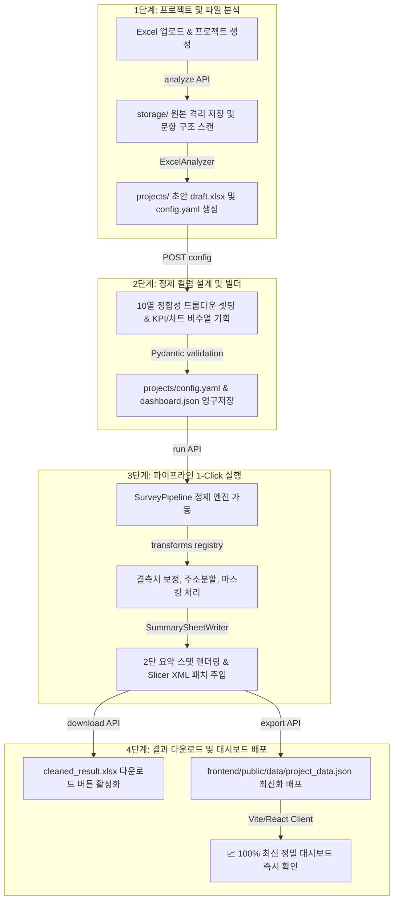
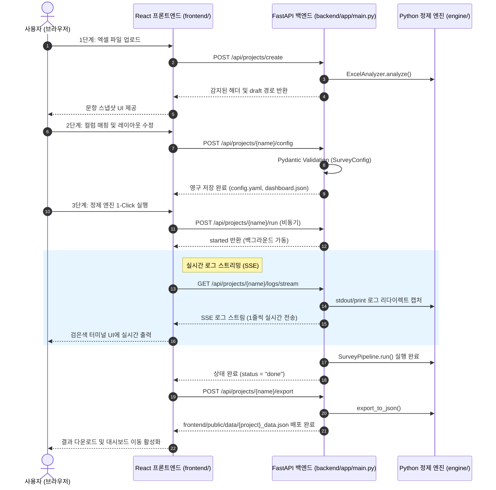

# 📊 ClearSurvey (클리어서베이)

[](https://www.python.org/)
[](https://vite.dev/)
[](https://fastapi.tiangolo.com/)
[](https://github.com/chamgil71/clearsurvey/actions/workflows/ci.yml)
[](#2-백엔드-서버-분리-운영-설계의-타당성)

> **1-Click 데이터 정밀 정제 · 엑셀 자동 요약 보고서 발행 · 하이브리드 인터랙티브 웹 대시보드**  
> 설문지나 업무용 행정 데이터 등 원본 엑셀(Raw Data)의 불완전하고 결측된 구조를 파이썬 정제 파이프라인 엔진을 통해 **정밀 클렌징**하고, openpyxl 및 슬라이서 패치 기술로 **엑셀 요약 보고서**를 발행하며, **FastAPI ➡️ React/Vite/shadcn/ui**의 프리미엄 하이브리드 대시보드를 연계 공급하는 차세대 풀스택 데이터 지능 플랫폼입니다.

---

## 📌 주요 특징 (Key Features)

* **🔄 하이브리드 듀얼 모드**:
  - **정적 모드 [Static Mode]**: 백엔드 연결이 차단된 GitHub Pages 환경에서도 데모 JSON을 파싱하여 차트, 드로어, PDF/CSV 편의 기능을 우아하게 서비스합니다.
  - **풀스택 모드 [Fullstack Mode]**: 로컬 API 서버(FastAPI)와 연동되어 신규 파일 업로드, 10열 드롭다운 매핑, 실시간 정제 파이프라인 트리거가 즉시 가능합니다.
* **📋 10열 드롭다운 컬럼 정의 시트**: 엑셀의 정밀 정합성 및 변환 규칙(Transforms 20여종), 원본 엑셀 열번호 매핑 등을 마우스 클릭 몇 번으로 쉽게 편집하고 `config.yaml`에 영구 저장합니다.
* **📊 대시보드 비주얼 빌더**: 대시보드 상단에 배치될 KPI 핵심 스탯 및 시각화 차트(Donut, Bar, Hbar, Histogram, Multibar)를 타이핑 없이 비주얼 폼을 통해 기획 설계합니다.
* **📟 실시간 런타임 로그 스트리밍**: 정밀 분석기 및 클렌징 엔진의 구동 로그 과정을 검은색 터미널 콘솔창 레이아웃을 통해 실시간으로 눈으로 투명하게 확인합니다.
* **📱 프리미엄 슬라이딩 드로어 & PDF**:
  - **우측 상세 드로어**: 테이블 행 클릭 시 화면 우측에서 부드럽게 미끄러지듯 노출되는 Drawer 상세 템플릿.
  - **A4 PDF 저장**: 상세 패널 레이아웃(여백, Noto Serif 폰트, 정렬)을 A4 가로/세로 오피스 규격 PDF 파일로 즉시 저장 다운로드합니다.
* **📤 대시보드 원클릭 PPT / PDF 내보내기**: 현재 필터가 적용된 상태 그대로 대시보드를 **PowerPoint(.pptx)** 또는 **A4 가로 PDF**로 저장합니다. PPT는 이미지가 아니라 PowerPoint에서 수치·범례를 직접 편집할 수 있는 **네이티브 차트 객체**(타이틀 · KPI 요약표 · 차트 슬라이드)로 생성됩니다. PDF는 차트를 **카드 단위로 캡처해 A4 3열 × 2행 격자에 배치**하므로 차트가 페이지 경계에서 잘리지 않고, 브라우저 창 크기와 무관하게 항상 같은 결과가 나옵니다(`2x1`·`2x2`·`full` 크기 설정은 그대로 유지되며, 페이지마다 프로젝트명 · 생성일시 · 페이지 번호가 머리글로 붙습니다). **PPT·PDF 모두 선택한 테마의 색을 따릅니다.** 두 라이브러리 모두 버튼 클릭 시점에만 동적 로드되어 초기 로딩 성능에 영향이 없습니다.
* **🧾 요약 탭 (표 + 문서 내보내기)**: 차트가 말하는 내용을 **표로 정리**해 보여주는 탭입니다. 차트 순서대로 `차트 제목 → 표(항목 · 값 · 비중)`가 이어지고, 하단 박스에 현재 필터 기준이 명시됩니다. 차트·필터를 바꾸면 표도 함께 바뀝니다(집계 함수를 차트와 공유하므로 수치가 어긋나지 않습니다). **A4 세로 PDF**와 편집 가능한 **Word(.docx)**로 내보낼 수 있고, 표에 표시할 열(값 · 비중 · 순위 · 누적 비중)은 어드민 Step 2에서 선택합니다.
* **✏️ 대시보드에서 값 직접 수정 (풀스택 모드)**: 목록 탭에서 행을 클릭해 우측 드로어에서 값을 고치고 저장하면 **차트·KPI·필터가 즉시 따라 갱신**되고, 「원본 XLSX」로 받는 엑셀에도 반영됩니다. 반대로 **엑셀에서 고친 파일을 되돌려 올리면** 바뀐 셀만 골라 흡수합니다(확인 미리보기를 거칩니다 — 엑셀은 서식·자동 날짜 변환으로 값을 조용히 바꾸기 때문입니다).
  - **핵심**: 손 편집은 결과 엑셀에 직접 쓰지 않고 `overrides.json`에 따로 쌓아 **파이프라인 최종 단계**(정제 규칙 적용 후)에 얹습니다. 결과 엑셀은 원본+설정에서 매번 새로 만드는 파생물이라 거기 직접 쓰면 **다음 정제 실행이 지워버리기** 때문입니다. 그래서 **정제를 몇 번 다시 돌려도 편집이 살아남고**, 언제든 정제 원래값으로 되돌릴 수 있습니다.
  - **편집·설정·XLSX 버튼은 로컬 API가 떠 있고 로그인했을 때만** 보입니다(헤더 배지가 현재 상태를 알려줍니다). 정적 모드에는 백엔드가 없어 원리적으로 불가능합니다.
  - **발행**은 「발행하기」 버튼 1회 = **커밋 1개 · 푸시 1회**입니다. 저장할 때마다 배포하지 않습니다.
* **🎨 브랜드 테마 15종**: 토스·애플·카카오·듀오링고·버셀 등 **실제 브랜드의 디자인 시스템**에서 뽑아낸 테마를 프로젝트마다 골라 적용합니다(어드민 Step 2). 색·모서리 둥글기·차트 팔레트가 한 번에 바뀌며, 로고 텍스트와 브랜드 타이틀도 프로젝트별로 지정할 수 있습니다. 기본 테마는 **토스**입니다. 앱의 모든 색이 시멘틱 토큰으로 통일돼 있어 하드코딩 없이 설정만으로 제어됩니다. 원본 가이드 350종은 [`docs/design/`](docs/design/)에 있고 `bun scripts/build-themes.mjs` 로 언제든 재생성합니다. 상세: [`frontend/src/theme/README.md`](frontend/src/theme/README.md)
* **💾 Excel Slicer 주입 해킹 기술**: 가공된 최종 엑셀 파일 내부에 네이티브 오피스 Slicer 피벗 XML을 파이썬 ZipArchive 컴파일 기법으로 강제 주입하여, 엑셀을 여는 순간 테이블 옆에 네이티브 다차원 필터링 버튼이 즉시 활성화됩니다.

---

## ⚙️ 시스템 아키텍처 (Architecture)

### 1. 데이터 흐름도 (Data Lifecycle Flow)



### 2. 웹 마법사 실시간 정제 시퀀스 (SSE Sequence Diagram)



---

## 📂 디렉토리 구조 (Directory Structure)

```
ClearSurvey/
├── GUIDE.md                    # ★ 메인 통합 가이드 (시작점)
├── README.md                   # 이 문서 — 프로젝트 개요
├── docker-compose.yml          # backend + frontend 컨테이너 오케스트레이션
├── start_web.bat               # 프론트엔드 Vite 개발 서버 배치 스크립트
├── start_backend.bat           # FastAPI 백엔드 서버 배치 스크립트
├── start_all.bat               # 백엔드+프론트엔드 동시 기동
├── backend/                    # Python 정제 엔진 + FastAPI 서버
│   ├── main.py                 # CLI 데이터 정제 및 내보내기 조율 스크립트
│   ├── pyproject.toml          # 파이썬 의존성 패키지 명세 (pip install -e ".[dev]")
│   ├── app/                    # FastAPI 백엔드 서버 (main.py)
│   ├── engine/                 # 핵심 정제 파이프라인 코어 엔진 모듈
│   ├── transforms/             # 날짜/주소/마스킹 등 개별 변환 함수 레지스트리
│   └── tests/                  # pytest 단위·통합·API 테스트
├── frontend/                   # React / Vite / Tailwind+shadcn 웹 대시보드 및 3단계 마법사
│   ├── scripts/                # build-themes.mjs (디자인 가이드 → 테마 생성)
│   ├── src/                    # components/dashboard, components/manager, hooks, routes 등
│   │   └── theme/              # 테마 팩 15종 + 카탈로그 (생성물 — theme/README.md 참조)
│   ├── public/data/            # 발행된 대시보드 JSON (git 추적됨 — Vercel이 서빙하는 대상)
│   └── tests/e2e/              # Playwright e2e 테스트
├── storage/                    # [Git 제외 — raw/backup] 프로젝트 레시피(config.yaml/dashboard.json)와
│   │                           #   업로드 원본 엑셀을 함께 보관 (projects/{name}/, raw/, backup/)
│   └── projects/{name}/        # 프로젝트별 config.yaml, dashboard.json, output/
└── docs/                       # 설계·가이드·로그 문서 보관 폴더 — 인덱스: docs/INDEX.md
    ├── plan/                   # 설계/기획서 — prd.md(살아있는 문서),
    │                           #   plan/complete/ = 완료(보존), plan/pending/ = 미착수
    ├── design/                 # 브랜드 350종 디자인 시스템 가이드 — 테마 팩의 원본 데이터
    ├── guides/                 # 운영/사용 가이드 (살아있는 참조 문서)
    ├── logs/                   # 작업 이력·테스트 결과 (append-only)
    └── archive/                # 현재 아키텍처와 맞지 않는 구버전 문서
```

---

## 🔐 인증 및 보안 (Authentication & Security)

### 1) 접근 제어 (Access Control)
- **공개 대시보드** (`/`): 인증 없이 누구나 접근 가능하며, `published: true`로 설정된 프로젝트 정보만 노출됩니다.
- **관리자 UI** (`/admin`): Supabase Session 기반 인증 게이트가 적용되어 있으며 미인증 상태 접근 시 `/login`으로 자동 리다이렉트됩니다.
- **백엔드 API 보호**: `/api/projects` 하위 모든 어드민 API는 요청 헤더의 `Authorization: Bearer <JWT>` 토큰을 Supabase Auth 서비스에 실시간 조회·검증하는 필터가 적용되어 있습니다. 
  - EventSource SSE 및 파일 다운로드처럼 헤더 주입이 제한되는 인터페이스는 `?token=...` 쿼리 파라미터를 통해 인증을 수행합니다.
  - 로컬 개발 및 CI 테스트 환경에서는 가짜 Supabase URL 설정을 감지하여 자동으로 바이패스하도록 설계되어 있습니다.

### 2) 로컬 환경 설정
`frontend/.env.local` 파일(프론트엔드용)을 생성하고 Supabase 프로젝트 정보를 기입합니다 (git 무시 처리됨).
```env
VITE_SUPABASE_URL=https://<your-project>.supabase.co
VITE_SUPABASE_ANON_KEY=<your-anon-key>
VITE_API_BASE_URL=http://localhost:8000
```

---

## 📦 Docker Compose 프로덕션 배포 (Production Deployment)

프로덕션 환경(Hetzner VPS, AWS 등)에 서비스를 단 한 번에 컨테이너화하여 안전하게 배포할 수 있는 Docker Compose 설정을 지원합니다.

### 1) 환경 변수 기입 (.env)
루트 경로에 `.env` 파일을 생성하고 프로덕션 Supabase API 정보를 입력합니다:
```env
SUPABASE_URL=https://<your-project>.supabase.co
SUPABASE_ANON_KEY=<your-anon-key>
```

### 2) 서비스 실행
```bash
# 컨테이너 빌드 및 백그라운드 구동
docker compose up --build -d
```
* **backend (포트 8000)**: FastAPI 서버가 가동되며 Supabase 원격 서버를 통해 JWT를 실시간 검증합니다. `storage/`, `frontend/public/data/` 디렉토리를 마운트하여 영속 데이터를 유지하고 프론트엔드와 공유합니다.
* **frontend (포트 80)**: React/Vite 빌드 자산이 Nginx를 통해 서빙되며, Nginx가 `/api`를 백엔드로 투명하게 프록싱합니다. SSE logs stream 전송용 버퍼링 제거 설정이 내장되어 있습니다.

---

## 🧪 테스트

### Python 단위 테스트
```bash
# 가상환경 활성화: & C:\ai\.venv314\Scripts\Activate.ps1
cd backend
pip install -e ".[dev]"
pytest -v
```

### TypeScript 타입 체크
```bash
cd frontend && bun install && bunx tsc --noEmit
```

### 프론트엔드 단위 테스트 (vitest)
```bash
cd frontend && bun run test
```

### Playwright E2E 테스트
```bash
cd frontend
bunx playwright install --with-deps chromium
bunx playwright test
# 결과는 docs/logs/ 에 저장됨 (gitignore)
```

---

## ⚡ 빠른 시작 (Getting Started)

### 1. 로컬 백엔드 API 서버 가동
파이썬 환경에 필수 의존성을 설치하고 FastAPI 서버를 가동합니다:
```bash
# 가상환경 활성화 (C:\ai 아래 프로젝트 공용)
#   PowerShell: & C:\ai\.venv314\Scripts\Activate.ps1
cd backend
pip install -e ".[dev]"
uvicorn app.main:app --reload --host 127.0.0.1 --port 8000
```
> 윈도우에서는 `start_backend.bat`이 위 과정을 대신한다(`C:\ai\.venv314` 기본 사용,
> `CLEARSURVEY_PYTHON`으로 경로 변경 가능).
* 서버 가동이 성공하면 `http://localhost:8000/api/health` 핑을 통해 백엔드가 활성화되어 설정 매니저와 동기화됩니다.

### 2. 프론트엔드 마법사 및 대시보드 구동
웹 클라이언트 소스 디렉토리로 이동해 Vite 개발 서버를 구동합니다:
```bash
cd frontend
bun install
bun run dev
```
* 브라우저에서 `http://localhost:5173/` 경로로 즉시 공개 대시보드에 접속하고, `/admin` 으로 어드민에 접근합니다.

---

## 🚀 하이브리드 가동 및 비용 정보

매일 정해진 자동화와 분석 업무에 사용 요금 $0 비용을 유지하는 풀스택 아키텍처 스펙입니다.

| 서비스 구성 | 가동 플랫폼 | 사용 요금 | 설명 |
| :--- | :--- | :--- | :--- |
| **정적 호스팅** | GitHub Pages / Vercel | **$0** | 초고속 글로벌 CDN 및 정적 뷰어 대시보드 무료 호스팅 |
| **백엔드 서버** | 로컬 Uvicorn | **$0** | 정밀 파이프라인 구동 및 동적 CRUD 로컬 무제한 연산 |
| **정제 엔진 코어** | Python Core Engine | **$0** | pandas 및 openpyxl 라이브러리를 활용한 정밀 정제 무료 |
| **합계** | - | **$0 / 월** | **완전 무료 프리미엄 아키텍처 유지보수 보장** |
