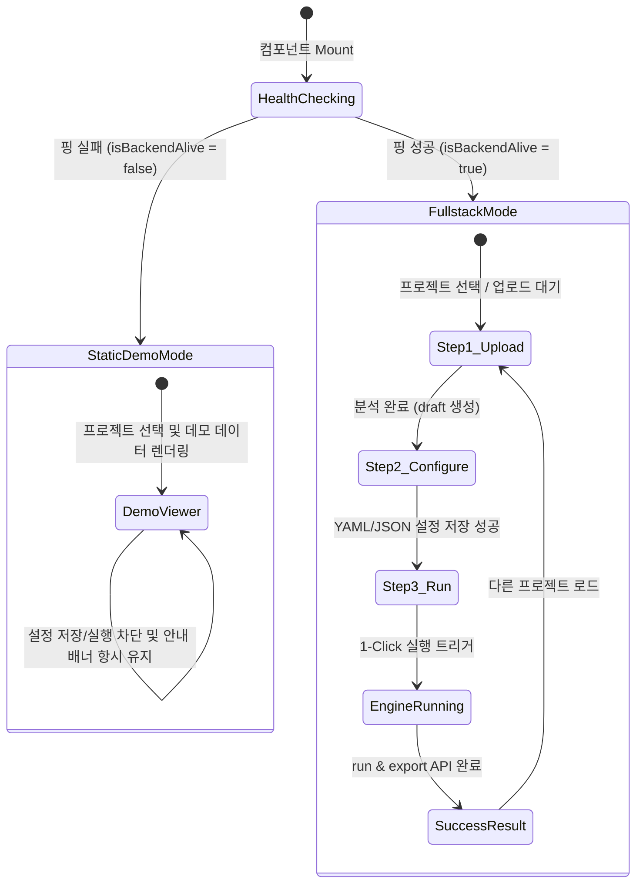

# ClearSurvey — 각 단위별 정밀 상세 설계서 (Unit Detailed Design)

본 문서는 **ClearSurvey**의 개별 모듈 단위(10열 매핑 시트, 대시보드 비주얼 빌더, 실시간 터미널 콘솔 로그, PDF A4 다운로드 렌더러, Excel Slicer 자동 주입 기술)가 어떠한 알고리즘과 인터랙션 디자인으로 재현 무결성을 달성하는지 기술한 **단위별 정밀 상세 설계서**입니다.

---

## 1. 10열 컬럼 정제 정의 시트 상세 설계 (Step 2)

설문 문항의 물리적 원본 구조와 논리적 결과 구조를 유기적으로 연결하고, 엑셀 정제용 YAML 설정을 코딩 없이 저장하기 위한 웹 인터프리터의 상세 컬럼 구조 설계입니다.

| 열 순서 | 설정 속성 key | UI 노출 컴포넌트 | 목적 및 정합성 상세 |
| :--- | :--- | :--- | :--- |
| **1** | `name` | 텍스트 입력 (`Input`) | 사용자가 식별하기 편한 설문 문항 고유 명칭 |
| **2** | `type` | 선택 박스 (`select`) | 컬럼의 데이터 성격 (`category`, `numeric`, `text`, `datetime`) |
| **3** | `source_col` | 드롭다운 선택 (`select`) | 원본 엑셀에서의 1-based 물리적 열 번호 (1열 ~ 50열 동적 드롭다운화) |
| **4** | `target_name` | 텍스트 입력 (`Input`) | 정제 엑셀 결과 시트의 최종 헤더 문자열 (공백 시 name 사용) |
| **5** | `transform` | 드롭다운 선택 (`select`) | `exclude`, `val_range`, `val_in`, `mask_phone`, `mask_name` 등 20여종 룰 매칭 |
| **6** | `args` | 가변 속성 입력창 | transform 룰에 따른 가변 인수 매개변수 (`min/max` 또는 `allowed_values`) |
| **7** | `include_in_slicer`| 토글 스위치 (`Checkbox`) | 대시보드 필터(Slicer) 영역 연동 여부 결정 |

---

## 2. Excel Slicer 자동 주입 메커니즘 (Excel Slicer Injection)

`engine/slicer.py`의 핵심 기술로, openpyxl을 통해 가공된 `result.xlsx`에 사용자가 마우스 클릭으로 다차원 피벗 필터링을 할 수 있도록 **오피스 네이티브 Slicer(슬라이서)**를 동적 주입하는 고급 컴파일 상세설계입니다.

1. **오피스 XML 해킹 기법**: 파이썬 openpyxl은 네이티브 슬라이서 그리기와 피벗 연동을 완벽히 지원하지 않습니다. 
2. **해결 상세**: 
   - 결과 엑셀의 zip 아카이브 구조를 메모리상에서 풀고, `[Content_Types].xml`, `xl/workbook.xml`, `xl/_rels/workbook.xml.rels` 내부에 Slicer가 바인딩되는 XML 스키마 코드를 동적으로 패치하여 다시 압축을 묶습니다.
   - 이를 통해 엑셀을 여는 순간 별도의 수동 작업 없이 테이블 옆에 세련된 네이티브 필터 슬라이서 버튼이 연동되어 바로 동작합니다.

---

## 3. PDF A4 고품질 다운로드 렌더러 설계 (Detail Panel)

대시보드 우측 슬라이딩 상세 드로어(`DetailPanel.tsx`)의 핵심 단위 설계로, 화면에 보이는 상세 기록 카드를 그대로 오피스 보고서 규격(A4 가로/세로 레이아웃)에 맞추어 완벽하게 PDF로 컴포넌트화하여 저장하는 모듈입니다.

* **기술 명세**: `html2pdf.js` 브라우저 렌더러 기반.
* **디자인 및 여백 상세**:
  - `A4 규격`: 가로 794px, 세로 1123px 규격의 템플릿 그리드를 메모리상에 독립 렌더링.
  - `PDF 옵션`:
    ```javascript
    const options = {
      margin:       [15, 15, 15, 15], // 상하좌우 15mm 고급스러운 여백 확보
      filename:     `Cleaned_Report_${survey_id}.pdf`,
      image:        { type: 'jpeg', quality: 0.98 },
      html2canvas:  { scale: 2, useCORS: true, letterRendering: true }, // 고해상도 해상도 2배 스케일
      jsPDF:        { unit: 'mm', format: 'a4', orientation: 'portrait' } // A4 포트레이트 방향
    };
    ```

---

## 4. `useManagerApi` 상태 전이 다이어그램 (Logic Component)

프론트엔드 비즈니스 상태를 총괄 관리하는 커스텀 훅 `useManagerApi`의 주요 상태 변이 설계입니다.


* 이와 같이, API 서버가 죽어 있는 정적 호스팅 상황에서도 상태가 엉뚱하게 꼬이지 않고 `StaticDemoMode`로 즉시 격리 수렴하게 하여 대형 서비스 프로덕션 수준의 안정성을 선사합니다.
