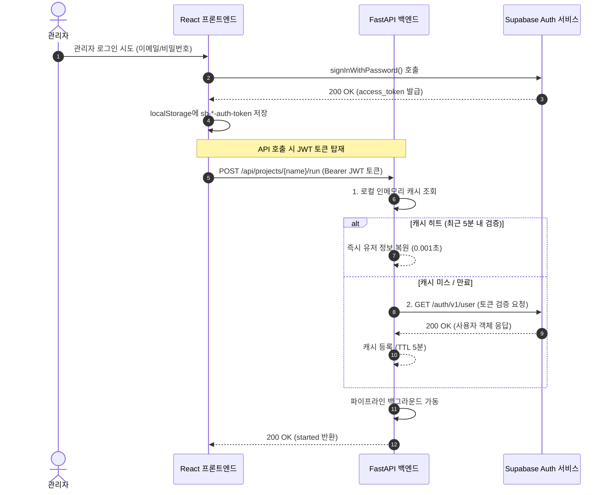

# 🔐 ClearSurvey 관리자 로그인 및 인증 가이드 (Admin Auth Guide)

본 문서는 **ClearSurvey** 어드민 대시보드 및 백엔드 API 보안에 탑재된 로그인/인증 메커니즘과 이번 개선 패치 내역을 상세히 설명하는 관리 가이드라인입니다.

---

## 1. 인증 시스템 아키텍처 개요

ClearSurvey는 프론트엔드 SSR(Server-Side Rendering) 및 클라이언트 환경과 파이썬 백엔드(FastAPI)가 완전 격리된 하이브리드 관심사 분리 아키텍처로 구동됩니다. 관리자 권한이 요구되는 프로젝트 생성, 설정 변경, 정제 실행 및 다운로드 API는 보호받아야 하므로 다음 흐름으로 인증 보안이 성립됩니다.

---

## 2. 두 가지 인증 모드

ClearSurvey는 개발 편의성과 실서비스 배포 정합성을 동시에 만족하기 위해 **이중화 모드**로 자동 감지되어 동작합니다.

### ① 실서버 연동 모드 (Supabase JWT 모드)
* **조건**: 환경 변수 `VITE_SUPABASE_URL` 및 `SUPABASE_URL`에 `placeholder`가 아닌 실제 Supabase 프로젝트 URL이 존재할 때 자동 활성화됩니다.
* **로그인**: 사용자는 로그인 화면에서 실제 계정 정보로 로그인해야 하며, Supabase가 세션 데이터(`sb-[project]-auth-token`)를 localStorage에 보존합니다.
* **백엔드 검증**: 백엔드의 `verify_supabase_token` 디펜던시가 활성화되어 요청 헤더의 Bearer 토큰을 Supabase Auth API를 통해 실시간 검증합니다.

### ② 로컬 개발 및 오프라인 우회 모드
* **조건**: 환경 변수 파일에 Supabase 설정이 비어있거나 `placeholder.supabase.co` URL이 설정되어 있을 때 활성화됩니다.
* **로그인**: 로그인 화면에 `⚠️ 로컬 개발 모드` 경고 뱃지가 노출되며, 이메일/비밀번호에 임의의 값을 적거나 GitHub 단추를 클릭하면 즉시 `"sb-local-session"` 세션을 로컬 디스크에 심어 **로그인을 우회**합니다.
* **백엔드 검증**: 백엔드 역시 placeholder URL을 감지하면, 검증 과정을 바이패스(Bypass)하고 임의의 `local_dev_user` 권한으로 모든 API 호출을 즉각 승인합니다.

---

## 3. 이번 핵심 개선 패치 내역

기존의 로그인 프로세스가 가진 5대 취약성 및 성능 지연 버그들을 다음과 같이 완벽히 수정하였습니다.

### 1) SSR 환경에서의 localStorage 참조 에러 원천 해결
* **기존 문제**: 프론트엔드의 `getLocalAccessToken` 함수가 SSR 컴파일/렌더링 시점에 Node.js 서버 환경에서 호출될 때, 브라우저 전용 객체인 `localStorage`가 미정의되어 `ReferenceError` 크래시를 유발했습니다.
* **개선 조치**: [useManagerApi.ts](file:///c:/ai/clearsurvey/frontend/src/hooks/useManagerApi.ts) 내 토큰 획득 함수 초입에 `if (typeof window === "undefined") return null;` 안전 가드를 주입하여 컴파일 및 SSR 안정성을 확보했습니다.

### 2) 로컬 우회 로그인 토큰 연동 및 정합성 보장
* **기존 문제**: 프론트엔드가 로컬 우회 로그인 완료 후 `"sb-local-session"`을 생성했음에도, API 공통 단에서는 `sb-*-auth-token` 포맷만 탐색하여 백엔드로 토큰을 보내지 못했습니다. 백엔드가 실제 Supabase URL을 가진 상태에서 로컬 접속을 시도하면 즉각 401 에러가 발생했습니다.
* **개선 조치**: 로컬 모드 감지 시 프론트엔드는 임시 바이패스 토큰 `"local-dev-bypass-token"`을 헤더에 탑재해 쏘도록 개선하였고, 백엔드 역시 해당 토큰 수신 시 실제 통신 없이 바로 무결하게 허가하도록 [main.py](file:///c:/ai/clearsurvey/backend/app/main.py) 디펜던시 필터를 보강했습니다.

### 3) API 401 Unauthorized 감지 시 세션 자동 만료 및 리다이렉션
* **기존 문제**: 토큰 수명이 만료되었을 때 백엔드가 401 Unauthorized 에러를 리턴하면, 프론트엔드 단에서 에러가 무시되거나 대시보드 통신 에러 창만 노출되고 로그인 페이지로의 복귀가 불가능했습니다.
* **개선 조치**: `fetchWithAuth` 비동기 래퍼가 백엔드 API 응답 중 `401` 상태 코드를 가로채면, 즉시 브라우저 내의 로그인 토큰/세션 데이터를 일괄 삭제(`removeItem`)하고, 토스트 알림을 통해 안내한 후 자동으로 현재 머물던 경로 정보를 리다이렉트 주소로 머금고 `/login?redirect=...` 페이지로 강제 튕겨나가게 자동화 핸들러를 완비했습니다.

### 4) 실제 Supabase 로그아웃 시 리다이렉트 지연 해소
* **기존 문제**: 실서버 모드에서 로그아웃 클릭 시 `supabase.auth.signOut()`만 실행하고 리다이렉션 처리가 없어, 화면 전환이 늦어지거나 멈춰 서 있는 듯한 UX 불편이 존재했습니다.
* **개선 조치**: [admin.tsx](file:///c:/ai/clearsurvey/frontend/src/routes/admin.tsx)의 `handleSignOut` 내에 실제 세션 소거 직후 `window.location.href = "/login"` 처리를 명시화하여 딜레이 없이 로그인 폼으로 귀환하도록 수정했습니다.

### 5) 백엔드 인메모리 토큰 캐싱을 통한 획기적인 레이턴시 개선
* **기존 문제**: 어드민 화면에서 프로젝트를 로드하거나 설정을 저장할 때마다 백엔드가 매번 Supabase Auth 원격 서버를 동기적으로 HTTP 리퀘스트하여 토큰을 확인하느라 API 응답이 약 `300ms ~ 500ms`씩 지연되어 조작이 묵직했습니다.
* **개선 조치**: 백엔드 `main.py`에 스레드 세이프한 인메모리 토큰 캐시(`_token_cache`)를 주입하고 **TTL 300초(5분)** 유효 기간을 설계했습니다. 5분 이내에 성공적으로 검증된 사용자는 Supabase 서버 호출을 원천 스킵하고 메모리에서 바로 승인 처리하여 API 호출 속도가 **1ms 미만**으로 비약적으로 향폭 상승했습니다.

---

## 4. 클라우드 배포 시 유의 사항 (디스크 영속화)

본 서비스를 AWS, GCP, Azure, Railway 등의 클라우드 환경에 Docker Compose 형태로 탑재할 경우 다음 요소를 확인해야 인증 및 동작에 지장이 없습니다.

1. **영속성 디스크 할당 (Persistent Volumes)**:
   * 업로드된 엑셀과 프로젝트 설정(`dashboard.json`)은 임시 컨테이너 파일시스템이 아닌 영속성 볼륨 디스크에 연결되어야 합니다.
   * Docker Compose 가동 시 설정된 `- ./storage:/app/storage` 볼륨 바인딩이 실제 호스트 머신의 영구 저장 디렉토리를 가리키는지 확인하십시오.
2. **Supabase 환경 변수 동기화**:
   * 프론트엔드 컨테이너 빌드 시점의 `.env` 파일과 백엔드 구동 시점의 환경 변수에 `SUPABASE_URL` 및 `SUPABASE_ANON_KEY`가 동일한 프로젝트를 가리키도록 설정해야 정상적인 로그인 토큰 해독 및 승인이 이루어집니다.
