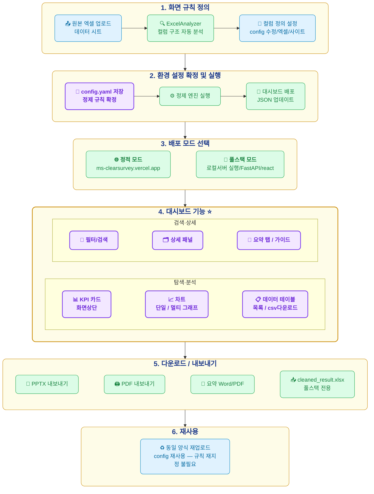

# ClearSurvey 시스템 흐름도

업로드부터 재사용까지 전체 워크플로우를 보여주는 구성도입니다. 색상 범례:
- 🔵 파란색 = 사람이 수행하는 작업
- 🟢 초록색 = 코드/엔진이 자동으로 수행하는 작업
- 🟣 보라색(굵게) = 이번 구성도에서 강조하는 핵심 기능 (AI 기능 아님)

> 이전 버전은 "3. 배포" 단계에 대시보드 기능이 작은 노드 하나로만 묻혀 있고, 대신 "4. 다운로드/내보내기"가 보라색으로 강조되어 있었습니다.
> 실제로 이 프로젝트의 핵심 가치는 **대시보드 자체(차트·필터·검색·상세보기 등)** 이고, 다운로드/내보내기는 부가 기능이므로 강조를 서로 바꿨습니다.

## 변경 요약 (이전 버전 대비)

| 항목 | 이전 | 수정 |
|---|---|---|
| 대시보드 기능 | "3. 배포" 안에 `JX` 노드 하나(차트/목록/요약/검색)로만 존재, 정적/풀스택 노드 사이에 끼어 눈에 안 띔 | 독립된 "4. 대시보드 기능 ⭐" 단계로 분리, 실제 컴포넌트(`KpiRow`, `ChartCard`, `DataTable`, `FilterBar`, `DetailPanel`, `SummaryTab`, `GuideDrawer`, `EditReviewPanel`) 기준 6개 노드로 보강, 보라색 강조 유지 |
| 다운로드/내보내기 | "4. 다운로드/내보내기"가 보라색 강조(`highlightBox`) + 빨간 테두리 하위 그룹(`공통`/`풀스택전용`)으로 시각적 비중 과다 | "5. 다운로드/내보내기"로 이동, 강조 해제 후 일반 초록색(`codeBox`)으로 하향, 하위 그룹 구조 제거하고 4개 노드를 한 줄로 단순화 |
| 대시보드 값 수정 | 다운로드 섹션에 잘못 배치(내보내기 기능이 아님) | 대시보드 기능 섹션의 "편집" 하위 그룹으로 이동 |
| 단계 번호 | 1~5단계 (배포 3단계에 다운로드까지 포함) | 1~6단계로 재편 (배포→대시보드 기능→다운로드→재사용 순으로 실제 사용 흐름과 일치) |
