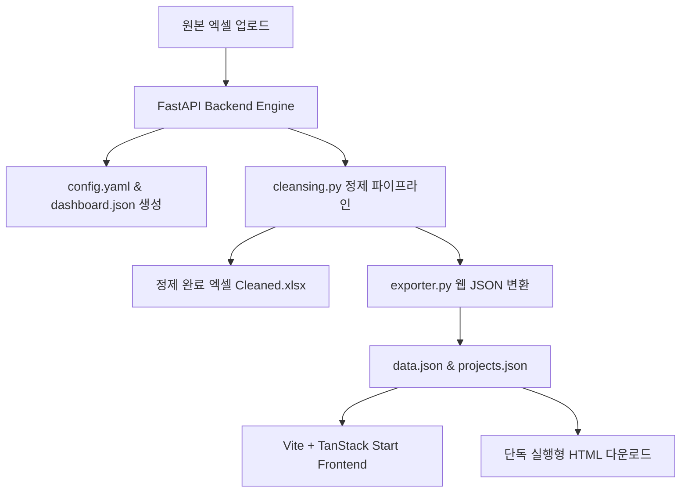

# Product Requirement Document (PRD) — ClearSurvey

## 1. 개요 및 목적 (Introduction & Purpose)
설문조사 데이터나 공공/기업 정산 실무 데이터는 원본 엑셀(Raw Excel) 형태로 수집되는 경우가 대부분입니다. 그러나 이 원본 데이터는 오타, 공백 불일치, 비표준 날짜, 마스킹 누락, 다중 응답 텍스트 결합 등 다양한 품질 이슈를 갖고 있어 즉각적인 통계 산출 및 데이터 분석에 부적합합니다.

**ClearSurvey**는 사용자가 수치화 및 정제 룰을 코딩 없이 웹 UI에서 손쉽게 정의하면, 백엔드 정제 엔진이 이를 YAML 매니페스트로 번역하여 원본 데이터를 대규모 클렌징하고, 그 결과로:
1. 규격 필터와 합계 수식이 아름답게 주입된 **정제 완료 엑셀 파일(Cleaned.xlsx)**을 생성하고,
2. 웹 및 모바일 브라우저에서 대화형으로 동작하는 **비주얼 통계 대시보드**를 자동 빌드하며,
3. 오프라인이나 내부망에서 단독 구동되는 **오프라인 1파일 HTML 보고서**를 제공하는 종합 설문 데이터 정제 및 비주얼 분석 솔루션입니다.

---

## 2. 주요 대상 고객 및 유스케이스 (Target Users & Usecases)
* **공공기관 및 기업 설문 실무자**: 다중 선택 문항 분석이나 주소지 시도 분리, 마스킹(개인정보 가리기) 처리를 엑셀 함수 노가다 없이 클릭 몇 번으로 자동화하고자 하는 사용자.
* **데이터 분석가 및 관리자**: 정제 완료된 설문 결과와 필터 슬라이서들을 웹상에서 반응형 차트로 실시간 스크리닝하고 요약 리포트를 다운로드하고자 하는 사용자.
* **내부망/오프라인 배포 담당자**: 외부 인터넷망이나 데이터베이스 연결 없이도 클라이언트에게 대시보드와 필터/검색/다운로드가 작동하는 리포트를 원파일로 전달하려는 실무자.

---

## 3. 핵심 기능 요구사항 (Product Features & Scope)

### ① 지능형 엑셀 분석 및 컬럼 매핑 (자동 분석기)
* 엑셀 원본 파일 업로드 시, 상위 5개 행 내에서 가장 밀도가 높고 조밀한 텍스트 행을 **제목행(Header Row)**으로 자동 감지합니다.
* 제목행 바로 하단을 정밀 스캔하여 데이터가 실제로 기입되기 시작하는 **데이터 시작행(Data Start Row)**을 유동적으로 판별합니다.
* 열 레이블 명칭을 분석하여 이메일(`validate_email`), 연락처(`normalize_phone`), 회사명(`normalize_company`), 날짜(`normalize_date`) 등의 정제 변환 룰을 자동 제안합니다.

### ② 명품 데이터 정제 규칙 사전 (Cleansing Engine)
* **`date_year`**: 날짜(예: `2026-06-30`, `2026년 5월`)에서 YYYY 4자리 연도 숫자만 지능적으로 파싱하여 정수로 보정합니다.
* **`split_binary`**: O열에 적힌 콤마 연결형 복수 선택 응답(예: `AI모델, 데이터`)에 대해 개별 키워드별 파생 열(`_AI모델`, `_데이터`)을 엑셀 시트에 동적으로 우측 인서트 확장하고 1/0 플래그로 쪼개어 기록합니다.
* **`group_sum`**: 사용자가 지정한 여러 엑셀 열 번호(`source_cols`)를 취합해 행별로 누적 합산한 결과 열을 주입합니다.
* **기타 표준화**: 이메일 유효성 검사, 사업자번호 검사, 이름/주민번호 뒷자리 마스킹, 주소지 시도/시군구 자동 분류(`addr_split`) 등을 내장합니다.

### ③ 엑셀 산출물 실무 최적화 (Cleaned Sheet Writer)
* 결과 엑셀 시트 1행에 합산 수식(`SUBTOTAL(9, ...)`)을 자동 인서트하여 엑셀 필터링 시 합계가 동적으로 연동되게 합니다.
* 웹상에서 스위치 조작을 통해 **결과 엑셀 내 네이티브 필터 슬라이서(Slicers)** 포함 여부와 **요약 차트 시트 삽입** 여부를 On/Off 제어할 수 있게 합니다.

### ④ 웹 비주얼 대시보드 설계자 (Dashboard Builder)
* 요약 카드를 조립할 수 있는 **KPI 요약 카드 구성기**(전체 건수, 특정값 카운트, 와일드카드 포함 필터, 부정 필터, 특정 열 수치 합계)를 제공합니다.
* Donut, Bar, Horizontal Bar, Histogram 및 다중 수치 합산용 **`multibar`** 차트를 조립할 수 있는 차트 설계 도구를 내장합니다.
* 차트 카드의 데이터 정렬 순서(`값 내림차순 / 값 오름차순 / 이름 가나다순 / 설정순`)와 표시할 상위 항목 수 한도(`5개, 10개, 15개, 20개, 전체`)를 개별 콤보박스로 세밀하게 튜닝할 수 있게 지원합니다.

### ⑤ 오프라인 원파일 HTML 보고서 익스포트 (Offline Reporter)
* 인터넷이 차단된 폐쇄망에서도 브라우저로 열기만 하면 대시보드 카드, Chart.js 동적 차트, 데이터 표 뷰어가 완벽히 렌더링되게 합니다.
* 상단 필터 선택과 키워드 검색 시 브라우저 메모리상에서 순수 자바스크립트로 초고속 필터링 및 차트 리드로잉이 실행되는 코어를 내장합니다.
* 사용자가 필터링한 결과 데이터를 그 자리에서 즉시 CSV 포맷 엑셀 파일로 메모리 다운로드시키는 단추를 탑재합니다.

---

## 4. 기술 스택 및 파일 시스템 아키텍처 (Technical Stack & Architecture)

### ① 백엔드 (Backend)
* **언어 & 프레임워크**: Python 3.11+, FastAPI, Uvicorn
* **라이브러리**: `pandas` (고속 데이터 가공), `openpyxl` (엑셀 스타일 및 XML 슬라이서/차트 제어)
* **데이터 보관소 (Storage layout)**:
  * `storage/raw/` : 업로드된 엑셀 원본 파일 보관
  * `storage/projects/{projectName}/` : `config.yaml` (정제 설정) 및 `dashboard.json` (대시보드 설계) 파일 보관

### ② 프론트엔드 (Frontend)
* **프레임워크**: React, TypeScript, Vite, TanStack Start (SSR 라우팅 및 렌더링)
* **스타일링**: Tailwind CSS, Radix UI (Shadcn UI 빌딩 블록)
* **데이터 배포 폴더**: `frontend/public/data/` 내부의 `projects.json` (목록 매니페스트) 및 `{projectName}_data.json`

---

## 5. 품질 속성 및 비기능 요구사항 (Non-Functional Requirements)
* **보안성 (Security)**: `validate_email`, `name_blind`, `mask_rrn` 등의 마스킹 규칙을 적용해 정제 엑셀 및 JSON 배포 파일 내에 개인정보 원본이 절대 유출되지 않도록 방지합니다.
* **오류 복원력 (Error Handling)**: 엑셀 파일의 비어있는 결측치 셀이 파이썬 `NaN` 부동소수점 상태로 JSON에 유입되지 않도록 `None` (null) 값으로 철저히 차단 가공하여 프론트엔드 파싱 오류를 원천 예방합니다.
* **응답성 (Performance)**: 대시보드 로딩 시 데이터 패치가 블로킹되지 않도록 비동기 처리하며, 대용량 정제 프로세스는 FastAPI `BackgroundTasks` 스레드 상에서 안전하게 구동하여 HTTP 타임아웃 오류를 방지합니다.
